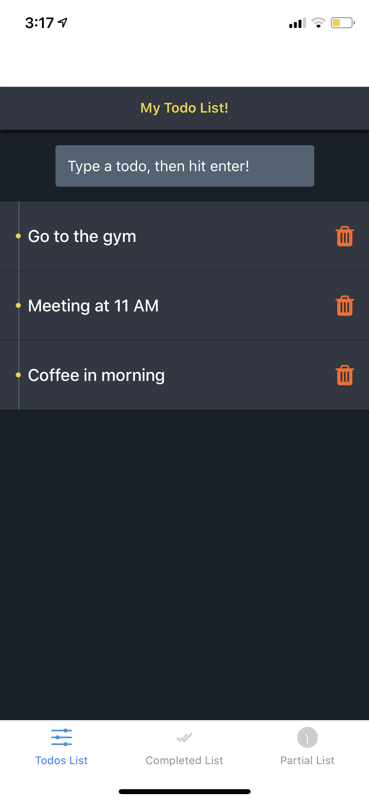

# images

# todo-app
Todo App using React Native

How to Setup:

Clone & install

1. Clone the repo.
2. Go to the app directory.
3. Run npm install.
4. Run npm start.

Mobile Device

Download Expo app.
Scan QR code from mobile or Open explore tab, Press search and Enter url shown in terminal.

