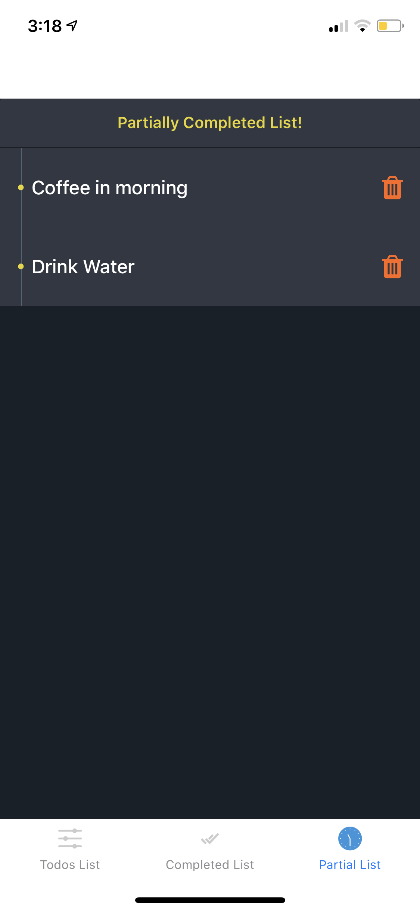

# todo-app
Todo App using React Native and Redux

How to Setup:

a.Clone & install

1. Clone the repo.
2. Go to the app directory.
3. Run npm install.
4. Run npm start.

b.Mobile Device

Download Expo app.
Scan QR code from mobile or Open explore tab, Press search and Enter url shown in terminal.

React Native is Used for Front End Operations with Redux as a global state manager.

# Functionality of the Todo App

1. The Home Screen(Todo List Tab) is a Todo List where you can add todos.
2. The delete button can delete a todo.
3. On Swipe Right, the todo is completed and moves to the Completed Screen(Complete List Tab).
4. On Swipre Left, the todo is partially completed and moves to the Partially Completed Screen (Partial List Tab).
5. The 3 tabs act as the 3 filters of the state of a todo.
6. You can delete a particular todo from any screen (state).

# images

